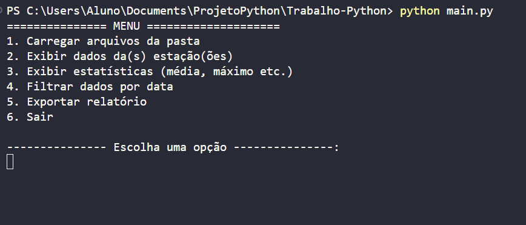
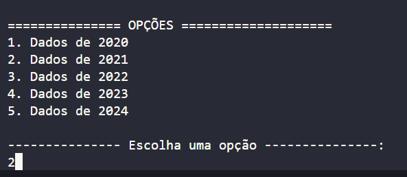
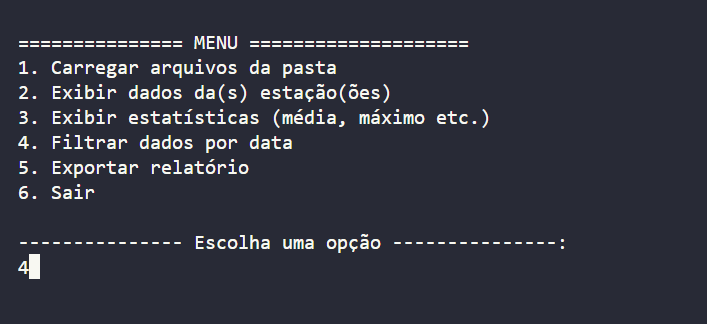

# Relatório de Dados do INMET

Aplicação em **Python puro** (sem bibliotecas externas) para análise de microdados meteorológicos fornecidos pelo **INMET (Instituto Nacional de Meteorologia)** referentes ao período de **2020 a 2025**.  
O sistema organiza, processa e exibe estatísticas climáticas em um **menu interativo no terminal**, permitindo ao usuário explorar os dados de forma simples e eficiente.

---
## ✨ Funcionalidades

- **Leitura de arquivos CSV**: interpreta registros meteorológicos coletados em diversas estações do país.  
- **Modelagem orientada a objetos (POO)**: utilização de classes e conceitos como encapsulamento, herança, polimorfismo e composição.  
- **Exibição de dados**: visualização de informações sobre estações meteorológicas e seus registros.  
- **Estatísticas climáticas**: cálculo de médias, máximos, totais e outros indicadores (ex.: temperatura, umidade, precipitação).  
- **Filtragem por data**: permite analisar apenas os registros de períodos específicos.  
- **Exportação de relatórios**: geração de relatórios com dados e estatísticas diretamente pelo terminal.  
- **Tratamento de erros**: robustez na leitura e manipulação dos arquivos.  
- **Interface em menu de terminal**: interação simples e organizada para o usuário.  

---

## 📌 Requisitos

-   [Python](https://www.python.org/downloads/)

---

## 🚀 Instalação

Clone o repositório e execute o projeto:

```sh
# Clonar o repositório
git clone https://github.com/GustavoProcopio27/Trabalho-Python.git

# Entrar na pasta do projeto
cd Trabalho-Python

# Rodar o programa principal
python main.py

```    
## Modo de Uso 

Após fazer a instalação, carregue os arquivos da pasta digitando 1



 Escolha o(s) ano(s) que deseja que sejam carregados para a utilização.
 


Após isso pode começar a analisar os dados.




## 👥 Colaboradores e desenvolvedores
| CARGO         | PESSOA                                                                 |
| ------------- | ---------------------------------------------------------------------- |
| PROFESSOR     | [Ulisses Roque Tomaz](https://github.com/UlissesRTomaz)                |
| DESENVOLVEDOR | [Miguel Da Silva Gomes](https://github.com/MiguelDaSilvaGomes)         |
| DESENVOLVEDOR | [Gustavo Luiz da Silva Procópio](https://github.com/GustavoProcopio27) |
